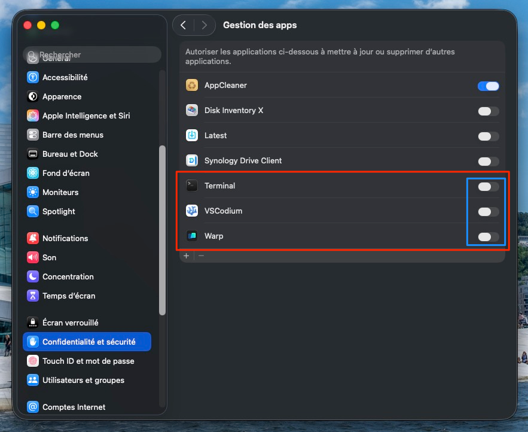

# synology-drive-ignore-nm

Are you using a Synology NAS and the Synology Drive app on MacOs ?

If you are a developer, you must be tired of the `node_modules` directory being synced, overloading the network and your machines' resources.

Look no further, this code fixes that!

# How to use this software

1. Clone this repository
2. Close Synology Drive
3. Install [Bun](https://bun.sh/) : `curl -fsSL https://bun.sh/install | bash`
4. Install the dependencies : `bun i`
5. Run the index script : `bun run start`
6. Start Synology Drive again and enjoy

## Build a binary
Alternatively, you can build a standalone binary that doesn't require Bun to be installed on the target machine:

```sh
bun run build
```

This produces an executable at `dist/synology-drive-ignore-nm`. To use it from anywhere, add an alias to your shell config:

```sh
# ~/.bashrc or ~/.zshrc
alias synology-drive-ignore-nm="/path/to/dist/synology-drive-ignore-nm"
```

Then reload your shell (`source ~/.zshrc` or `source ~/.bashrc`) and run `synology-drive-ignore-nm` anywhere.

## Ignoring additional directories

By default, the script will ignore `node_modules` directory only. If you want to ignore additional directories, you can pass them as a command line argument:

```sh
bun index.ts --ignore=dist,build,customDir
```

This will always include `node_modules` and also will add `dist`, `build`, and `customDir` to the list of directories to ignore.

## Permissions
You might encounter an error running this script claiming that you are not authorized to edit some files. It's normal, MacOS will restrict access to other apps' files by default. You need to explicitely allow it in System Preferences -> Security & Privacy -> Apps Management -> *\<Your terminal or IDE\>*.
> Don't forget to remove the permission once the process is done. Safety first!



# What does it do ?

The script goes in the following directory : `~/Library/Application Support/SynologyDrive/SynologyDrive.app/Contents/Resources/conf`

It then adds the "node_modules" value to two files :

| File             | Key       |
|------------------|-----------|
| blacklist.filter | Directory |
| filter-v4150     | Common    |
| filter-v4150     | Directory |

Once the word have been added to each key, Synology Drive will ignore the `node_modules` directories across your sync folder.

You've heard it right, it only takes a few clicks.

Some examples :

### blacklist.filter

```ini
[Version]
major=1
minor=1

[File]
black_ext_selective_sync="tmp", "temp", "swp", "lnk", "pst"
max_size_selective_sync=0

[Directory]
black_name="node_modules"
```

### filter-v4150

```ini
[Version]
major=1
minor=1

[Common]
black_char="\\/"
black_name="@tmp", "@eaDir", ".SynologyWorkingDirectory", "#recycle", "desktop.ini", ".ds_store", "Icon\r", "thumbs.db", "$Recycle.Bin", "@sharebin", "System Volume Information", "Program Files", "Program Files (x86)", "ProgramData", "#snapshot", "node_modules"
max_length=255
max_path=768

[File]
black_name="@tmp", "@eaDir", ".SynologyWorkingDirectory", "#recycle", "desktop.ini", ".ds_store", "Icon\r", "thumbs.db", "$Recycle.Bin", "@sharebin", "tmp", "temp", "System Volume Information", "Program Files", "Program Files (x86)", "ProgramData", "#snapshot"
black_prefix="~"
max_size=0

[Directory]
black_name="@tmp", "@eaDir", ".SynologyWorkingDirectory", "#recycle", "desktop.ini", ".ds_store", "Icon\r", "thumbs.db", "$Recycle.Bin", "@sharebin", "System Volume Information", "Program Files", "Program Files (x86)", "ProgramData", "#snapshot", "node_modules"

[EA]
```

# Why a custom npm package

If you look at the `package.json` file, you will see this following dependency : `@loice5/dangerous-ini`

The name might appears to be scary. It is a simple fork of [the ini package](https://www.npmjs.com/package/ini).

The key difference is how escaped characters are managed. With the initial ini package, when encoding again the file, quotes are escaped. It creates issues with how Synology Drive reads the file and makes the app crash.

Some other differences :
- Originally, the empty keys are not encoded. With the modified version, they are persisted.
- The lists of banned values are wrapped into simple quotes, creating syntax bugs. With the modified version, they are not anymore.

You can check the source code [here](https://github.com/LoicE5/dangerous-ini).